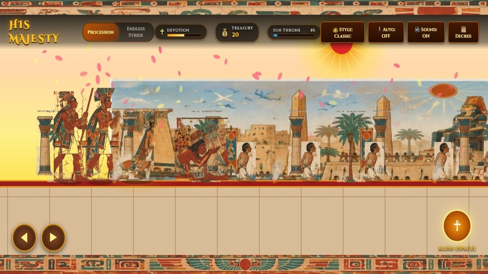
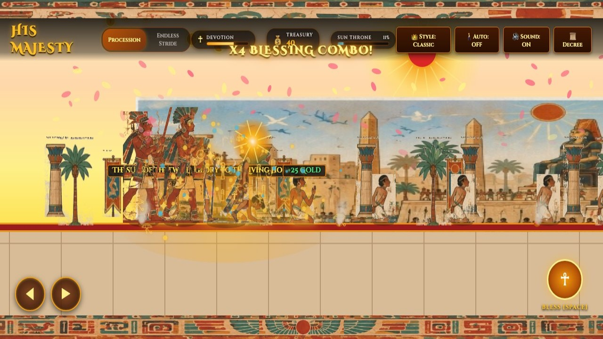
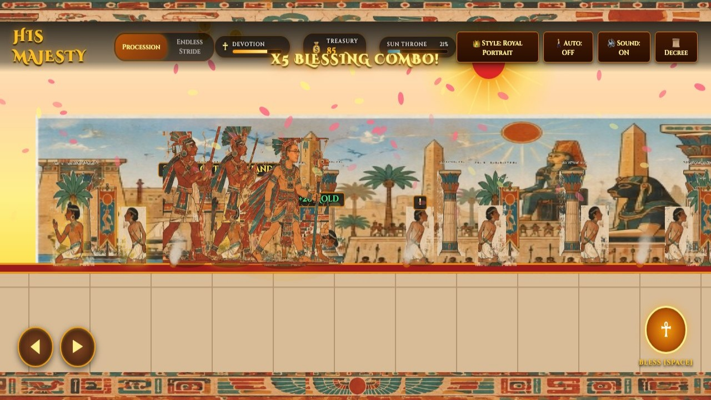

# 👑 His Majesty (The Divine Procession)

A 2D web-based ancient mural game inspired by Egyptian and Mesoamerican fresco art, featuring smooth side-scrolling, authentic hieroglyphic ornamentation, procedural crowd reactions, and immersive Web Audio sound synthesis.

---

## 📸 Gameplay Screenshots

| Royal Procession & Kneeling Slaves | Divine Scepter Blessing & Prostration |
| :---: | :---: |
|  |  |

| Royal Portrait Avatar (Figure 1 Design) & Tribute Collection |
| :---: |
|  |

---

## 🌟 Game Highlights

- **The Divine Walk Mechanic**:
  - Control His Divine Majesty as he strides down the grand imperial boulevard.
  - As His Majesty approaches, slaves, laborers, merchants, and foreign captives notice his divine presence (`!`), drop their burdens, sink to their knees (**Kneel & Greet**), and bend flat to the sandstone ground (**Prostrate**) in absolute humility as the King passes directly by.
- **Royal Entourage**:
  - The King is flanked by his faithful retinue:
    - **The Royal Parasol Bearer**: Keeping the divine sunshade over His Majesty.
    - **The Royal Fan Bearer**: Waving the ceremonial feather fan.
- **Divine Blessing & Tributes**:
  - Press `SPACE` or the glowing `☥` Scepter button to raise the Golden Falcon Scepter and cast celestial blessings upon kneeling subjects.
  - Subjects glow with golden divine radiance, chant reverent praises (*"All Hail His Divine Majesty!"*, *"Life, Prosperity, Health!"*), and offer golden tribute coins, precious urns, and jewel chests to fill the **Imperial Treasury**.
- **Authentic Mural Presentation**:
  - Extracted directly from the original artwork designs:
    - 7-frame animated King walk cycle.
    - Authentic top and bottom ancient Egyptian hieroglyphic friezes featuring the Great Winged Sun Disc.
    - Monumental landmarks: The Nile Docks & Royal Feluccas, Avenue of Obelisks, Great Colossus, Sphinx Statues, and the Lotus Colonnade.
    - Golden Sun Disc with radiant sunbeams, incense smoke particles, and falling lotus petals.
- **Dual King Styles**:
  - Switch freely between **Classic Pharaoh** (animated walk cycle sheet) and **Royal Portrait** (featuring the custom portrait in full winged regalia from Figure 1).
- **Audio Synthesizer (Web Audio API)**:
  - 100% self-contained modal Egyptian harp melodies, sistrum shimmers, sandstone footfalls, divine blessing glissandos, and victory fanfares without external audio dependencies.

---

## 🎮 Controls

| Action | Keyboard | Touch / Mouse |
| :--- | :--- | :--- |
| **Stride Forward** | `D` or `Right Arrow` | Tap / Hold `▶` on screen |
| **Pace Backward** | `A` or `Left Arrow` | Tap / Hold `◀` on screen |
| **Bestow Blessing** | `SPACE` or `E` | Tap `☥ BLESS` button |
| **Swift Imperial Stride** | Hold `SHIFT` | — |
| **Sistrum of Total Submission** | `Q` | Sounds sistrum; commands all subjects to hit the ground |
| **Toggle Avatar Style** | `V` | Click `👑 Style` button in top bar |
| **Cinematic Camera Zoom** | `C` | Cycles Normal / Close-up / Panoramic |
| **Toggle Auto-Procession** | `P` | Click `🚶 Auto` button in top bar |
| **Mute / Unmute Audio** | `M` | Click `🔊 Sound` button in top bar |

---

## 🚀 How to Run

### Quick Launch (macOS / Linux)
Double-click or run:
```bash
./start_game.sh
```
This automatically starts a local server and opens the game in your default browser.

### Manual Launch
```bash
python3 -m http.server 8080
```
Then navigate to: `http://localhost:8080` in any web browser.

---

## 🏛️ Project Structure

```
/Volumes/KIOXIA/hismajestyWalk2/
├── index.html                # Master game interface & canvas
├── start_game.sh             # Quick-launch bash script
├── README.md                 # Documentation
├── his_majesty_gameplay.mp4  # 720p HD gameplay video recording
├── css/
│   └── style.css             # Ancient fresco styling, responsive HUD, virtual controls
├── js/
│   ├── main.js               # 60fps render loop, asset preloading, lifecycle
│   ├── engine.js             # AssetManager, Camera parallax, ParticleSystem, Input
│   ├── king.js               # King controller, walk cycle, scepter blessing, entourage
│   ├── subject.js            # Subject AI: kneel, prostrate, offer gifts, speech bubbles
│   ├── world.js              # Multi-plane parallax, monuments, level progression
│   ├── audio.js              # Web Audio API Egyptian modal harp & sistrum synthesizer
│   └── ui.js                 # HUD status bars, treasury counter, victory coronation dialog
└── assets/
    ├── sprites/              # King walk cycle, entourage, subjects, sacred birds
    ├── backgrounds/          # Palace panorama, obelisks, sphinx, colonnade, palace gate
    ├── props/                # Lotus pillars, palms, throne, banners, urns, chests
    └── ui/                   # Hieroglyphic top/bottom borders, winged sun disc
```
